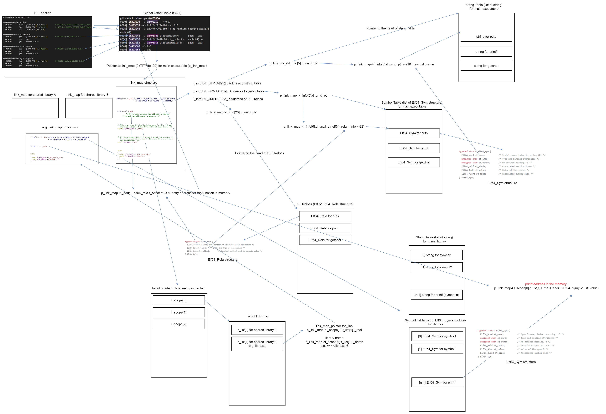

## build

```bash
$ gcc sample.c -fcf-protection=none -z norelro -no-pie -g -o sample
```

## show .plt section

<details>
<summary>show</summary>

```bash

$ objdump --no-show-raw-insn -M intel -j .plt -j .text -d sample

sample:     file format elf64-x86-64


Disassembly of section .plt:

0000000000401020 <.plt>:
  401020:       push   QWORD PTR [rip+0x2312]        # 403338 <_GLOBAL_OFFSET_TABLE_+0x8>
  401026:       jmp    QWORD PTR [rip+0x2314]        # 403340 <_GLOBAL_OFFSET_TABLE_+0x10>
  40102c:       nop    DWORD PTR [rax+0x0]

0000000000401030 <puts@plt>:
  401030:       jmp    QWORD PTR [rip+0x2312]        # 403348 <puts@GLIBC_2.2.5>
  401036:       push   0x0
  40103b:       jmp    401020 <.plt>

0000000000401040 <printf@plt>:
  401040:       jmp    QWORD PTR [rip+0x230a]        # 403350 <printf@GLIBC_2.2.5>
  401046:       push   0x1
  40104b:       jmp    401020 <.plt>

0000000000401050 <getchar@plt>:
  401050:       jmp    QWORD PTR [rip+0x2302]        # 403358 <getchar@GLIBC_2.2.5>
  401056:       push   0x2
  40105b:       jmp    401020 <.plt>

Disassembly of section .text:

0000000000401060 <_start>:
  401060:       endbr64 
  401064:       xor    ebp,ebp
  401066:       mov    r9,rdx
  401069:       pop    rsi
  40106a:       mov    rdx,rsp
  40106d:       and    rsp,0xfffffffffffffff0
  401071:       push   rax
  401072:       push   rsp
  401073:       mov    r8,0x4011f0
  40107a:       mov    rcx,0x401180
  401081:       mov    rdi,0x401146
  401088:       call   QWORD PTR [rip+0x2292]        # 403320 <__libc_start_main@GLIBC_2.2.5>
  40108e:       hlt    
  40108f:       nop

0000000000401090 <_dl_relocate_static_pie>:
  401090:       endbr64 
  401094:       ret    
  401095:       nop    WORD PTR cs:[rax+rax*1+0x0]
  40109f:       nop

00000000004010a0 <deregister_tm_clones>:
  4010a0:       mov    eax,0x403370
  4010a5:       cmp    rax,0x403370
  4010ab:       je     4010c0 <deregister_tm_clones+0x20>
  4010ad:       mov    eax,0x0
  4010b2:       test   rax,rax
  4010b5:       je     4010c0 <deregister_tm_clones+0x20>
  4010b7:       mov    edi,0x403370
  4010bc:       jmp    rax
  4010be:       xchg   ax,ax
  4010c0:       ret    
  4010c1:       data16 nop WORD PTR cs:[rax+rax*1+0x0]
  4010cc:       nop    DWORD PTR [rax+0x0]

00000000004010d0 <register_tm_clones>:
  4010d0:       mov    esi,0x403370
  4010d5:       sub    rsi,0x403370
  4010dc:       mov    rax,rsi
  4010df:       shr    rsi,0x3f
  4010e3:       sar    rax,0x3
  4010e7:       add    rsi,rax
  4010ea:       sar    rsi,1
  4010ed:       je     401100 <register_tm_clones+0x30>
  4010ef:       mov    eax,0x0
  4010f4:       test   rax,rax
  4010f7:       je     401100 <register_tm_clones+0x30>
  4010f9:       mov    edi,0x403370
  4010fe:       jmp    rax
  401100:       ret    
  401101:       data16 nop WORD PTR cs:[rax+rax*1+0x0]
  40110c:       nop    DWORD PTR [rax+0x0]

0000000000401110 <__do_global_dtors_aux>:
  401110:       endbr64 
  401114:       cmp    BYTE PTR [rip+0x2255],0x0        # 403370 <__TMC_END__>
  40111b:       jne    401130 <__do_global_dtors_aux+0x20>
  40111d:       push   rbp
  40111e:       mov    rbp,rsp
  401121:       call   4010a0 <deregister_tm_clones>
  401126:       mov    BYTE PTR [rip+0x2243],0x1        # 403370 <__TMC_END__>
  40112d:       pop    rbp
  40112e:       ret    
  40112f:       nop
  401130:       ret    
  401131:       data16 nop WORD PTR cs:[rax+rax*1+0x0]
  40113c:       nop    DWORD PTR [rax+0x0]

0000000000401140 <frame_dummy>:
  401140:       endbr64 
  401144:       jmp    4010d0 <register_tm_clones>

0000000000401146 <main>:
  401146:       push   rbp
  401147:       mov    rbp,rsp
  40114a:       lea    rdi,[rip+0xeb3]        # 402004 <_IO_stdin_used+0x4>
  401151:       mov    eax,0x0
  401156:       call   401040 <printf@plt>
  40115b:       lea    rdi,[rip+0xeae]        # 402010 <_IO_stdin_used+0x10>
  401162:       call   401030 <puts@plt>
  401167:       lea    rdi,[rip+0xea5]        # 402013 <_IO_stdin_used+0x13>
  40116e:       call   401030 <puts@plt>
  401173:       call   401050 <getchar@plt>
  401178:       mov    eax,0x0
  40117d:       pop    rbp
  40117e:       ret    
  40117f:       nop

0000000000401180 <__libc_csu_init>:
  401180:       endbr64 
  401184:       push   r15
  401186:       lea    r15,[rip+0x1fb3]        # 403140 <__frame_dummy_init_array_entry>
  40118d:       push   r14
  40118f:       mov    r14,rdx
  401192:       push   r13
  401194:       mov    r13,rsi
  401197:       push   r12
  401199:       mov    r12d,edi
  40119c:       push   rbp
  40119d:       lea    rbp,[rip+0x1fa4]        # 403148 <__do_global_dtors_aux_fini_array_entry>
  4011a4:       push   rbx
  4011a5:       sub    rbp,r15
  4011a8:       sub    rsp,0x8
  4011ac:       call   401000 <_init>
  4011b1:       sar    rbp,0x3
  4011b5:       je     4011d6 <__libc_csu_init+0x56>
  4011b7:       xor    ebx,ebx
  4011b9:       nop    DWORD PTR [rax+0x0]
  4011c0:       mov    rdx,r14
  4011c3:       mov    rsi,r13
  4011c6:       mov    edi,r12d
  4011c9:       call   QWORD PTR [r15+rbx*8]
  4011cd:       add    rbx,0x1
  4011d1:       cmp    rbp,rbx
  4011d4:       jne    4011c0 <__libc_csu_init+0x40>
  4011d6:       add    rsp,0x8
  4011da:       pop    rbx
  4011db:       pop    rbp
  4011dc:       pop    r12
  4011de:       pop    r13
  4011e0:       pop    r14
  4011e2:       pop    r15
  4011e4:       ret    
  4011e5:       data16 nop WORD PTR cs:[rax+rax*1+0x0]

00000000004011f0 <__libc_csu_fini>:
  4011f0:       endbr64 
  4011f4:       ret    
```

</details>

-> _GLOBAL_OFFSET_TABLE_ address = 403330  

## check GOT entry is resolved after function call.

```bash
$ gdb -q sample
```

set break point at `  printf("Hello world");`

```
gdb-peda$ b 4
Breakpoint 1 at 0x40114a: file sample.c, line 4.
```

run programm

<details>
<summary>show</summary>

```
gdb-peda$ r
Starting program: /home/ym/github/Security/PLT_GOT/sample 
[----------------------------------registers-----------------------------------]
RAX: 0x401146 (<main>:  push   rbp)
RBX: 0x401180 (<__libc_csu_init>:       endbr64)
RCX: 0x401180 (<__libc_csu_init>:       endbr64)
RDX: 0x7fffffffe1f8 --> 0x7fffffffe482 ("SHELL=/bin/bash")
RSI: 0x7fffffffe1e8 --> 0x7fffffffe45a ("/home/ym/github/Security/PLT_GOT/sample")
RDI: 0x1 
RBP: 0x7fffffffe0f0 --> 0x0 
RSP: 0x7fffffffe0f0 --> 0x0 
RIP: 0x40114a (<main+4>:        lea    rdi,[rip+0xeb3]        # 0x402004)
R8 : 0x0 
R9 : 0x7ffff7fe0d60 (<_dl_fini>:        endbr64)
R10: 0x7 
R11: 0x2 
R12: 0x401060 (<_start>:        endbr64)
R13: 0x7fffffffe1e0 --> 0x1 
R14: 0x0 
R15: 0x0
EFLAGS: 0x246 (carry PARITY adjust ZERO sign trap INTERRUPT direction overflow)
[-------------------------------------code-------------------------------------]
   0x401144 <frame_dummy+4>:    jmp    0x4010d0 <register_tm_clones>
   0x401146 <main>:     push   rbp
   0x401147 <main+1>:   mov    rbp,rsp
=> 0x40114a <main+4>:   lea    rdi,[rip+0xeb3]        # 0x402004
   0x401151 <main+11>:  mov    eax,0x0
   0x401156 <main+16>:  call   0x401040 <printf@plt>
   0x40115b <main+21>:  lea    rdi,[rip+0xeae]        # 0x402010
   0x401162 <main+28>:  call   0x401030 <puts@plt>
[------------------------------------stack-------------------------------------]
0000| 0x7fffffffe0f0 --> 0x0 
0008| 0x7fffffffe0f8 --> 0x7ffff7dee083 (<__libc_start_main+243>:       mov    edi,eax)
0016| 0x7fffffffe100 --> 0x7ffff7ffc620 --> 0x50a1000000000 
0024| 0x7fffffffe108 --> 0x7fffffffe1e8 --> 0x7fffffffe45a ("/home/ym/github/Security/PLT_GOT/sample")
0032| 0x7fffffffe110 --> 0x100000000 
0040| 0x7fffffffe118 --> 0x401146 (<main>:      push   rbp)
0048| 0x7fffffffe120 --> 0x401180 (<__libc_csu_init>:   endbr64)
0056| 0x7fffffffe128 --> 0xed6df6522031d3c 
[------------------------------------------------------------------------------]
Legend: code, data, rodata, value

Breakpoint 1, main () at sample.c:4
4         printf("Hello world");
```

</details>

show GOT contents at 0x403330

```
gdb-peda$ telescope 0x403330
0000| 0x403330 --> 0x403150 --> 0x1 
0008| 0x403338 --> 0x7ffff7ffe190 --> 0x0 
0016| 0x403340 --> 0x7ffff7fe7af0 (<_dl_runtime_resolve_xsave>: endbr64)
0024| 0x403348 --> 0x401036 (<puts@plt+6>:      push   0x0)
0032| 0x403350 --> 0x401046 (<printf@plt+6>:    push   0x1)
0040| 0x403358 --> 0x401056 (<getchar@plt+6>:   push   0x2)
0048| 0x403360 --> 0x0 
0056| 0x403368 --> 0x0 
```

-> Before calling each functions, each corresponding GOT entry is reffering to PLT.  
  
set break point at `  puts("a\n");` after `printf`

```
gdb-peda$ b 5
Breakpoint 2 at 0x40115b: file sample.c, line 5.
```

continue program

<details>
<summary>show</summary>

```
gdb-peda$ c
Continuing.
[----------------------------------registers-----------------------------------]
RAX: 0xb ('\x0b')
RBX: 0x401180 (<__libc_csu_init>:       endbr64)
RCX: 0x0 
RDX: 0x0 
RSI: 0x40200f --> 0xa62000a6100 ('')
RDI: 0x7ffff7fb87e0 --> 0x0 
RBP: 0x7fffffffe0f0 --> 0x0 
RSP: 0x7fffffffe0f0 --> 0x0 
RIP: 0x40115b (<main+21>:       lea    rdi,[rip+0xeae]        # 0x402010)
R8 : 0x0 
R9 : 0xb ('\x0b')
R10: 0x7ffff7fb6be0 --> 0x4046a0 --> 0x0 
R11: 0x7ffff7fb6be0 --> 0x4046a0 --> 0x0 
R12: 0x401060 (<_start>:        endbr64)
R13: 0x7fffffffe1e0 --> 0x1 
R14: 0x0 
R15: 0x0
EFLAGS: 0x206 (carry PARITY adjust zero sign trap INTERRUPT direction overflow)
[-------------------------------------code-------------------------------------]
   0x40114a <main+4>:   lea    rdi,[rip+0xeb3]        # 0x402004
   0x401151 <main+11>:  mov    eax,0x0
   0x401156 <main+16>:  call   0x401040 <printf@plt>
=> 0x40115b <main+21>:  lea    rdi,[rip+0xeae]        # 0x402010
   0x401162 <main+28>:  call   0x401030 <puts@plt>
   0x401167 <main+33>:  lea    rdi,[rip+0xea5]        # 0x402013
   0x40116e <main+40>:  call   0x401030 <puts@plt>
   0x401173 <main+45>:  call   0x401050 <getchar@plt>
[------------------------------------stack-------------------------------------]
0000| 0x7fffffffe0f0 --> 0x0 
0008| 0x7fffffffe0f8 --> 0x7ffff7dee083 (<__libc_start_main+243>:       mov    edi,eax)
0016| 0x7fffffffe100 --> 0x7ffff7ffc620 --> 0x50a1000000000 
0024| 0x7fffffffe108 --> 0x7fffffffe1e8 --> 0x7fffffffe45a ("/home/ym/github/Security/PLT_GOT/sample")
0032| 0x7fffffffe110 --> 0x100000000 
0040| 0x7fffffffe118 --> 0x401146 (<main>:      push   rbp)
0048| 0x7fffffffe120 --> 0x401180 (<__libc_csu_init>:   endbr64)
0056| 0x7fffffffe128 --> 0xed6df6522031d3c 
[------------------------------------------------------------------------------]
Legend: code, data, rodata, value

Breakpoint 2, main () at sample.c:5
5         puts("a\n");
```

</details>

show GOT contents at 0x403330 again

```
gdb-peda$ telescope 0x403330
0000| 0x403330 --> 0x403150 --> 0x1 
0008| 0x403338 --> 0x7ffff7ffe190 --> 0x0 
0016| 0x403340 --> 0x7ffff7fe7af0 (<_dl_runtime_resolve_xsave>: endbr64)
0024| 0x403348 --> 0x401036 (<puts@plt+6>:      push   0x0)
0032| 0x403350 --> 0x7ffff7e2bc90 (<__printf>:  endbr64) ★
0040| 0x403358 --> 0x401056 (<getchar@plt+6>:   push   0x2)
0048| 0x403360 --> 0x0 
0056| 0x403368 --> 0x0 
```

-> GOT entry corresponding to printf function is resolved and PLT address is replaced by actual function address.   


[ref] syokai security contest